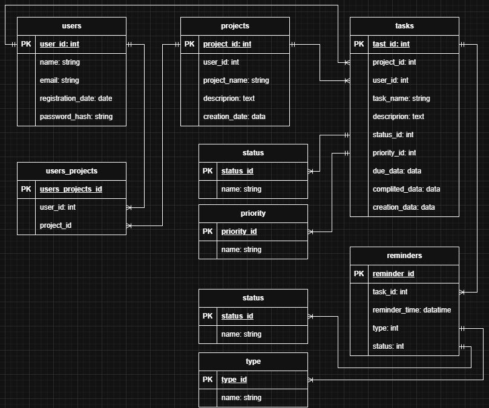

# Laborator_BD
# Лабораторные работы по Базам данных
**Студент:** Лебединский Илья  
**Группа:** 2272  
**Тема:** Система управления задачами (Task Management System)  
**Цель:** Спроектировать, реализовать и оптимизировать базу данных для управления проектами, задачами, пользователями и напоминаниями, нормализованную до 3NF.

## Лабораторная работа 1. Проектирование структуры БД


### Нормальные формы
- **1NF (Первая нормальная форма):**  
&nbsp;&nbsp;Соблюдена. Все атрибуты атомарны, строки уникальны, каждая таблица имеет первичный ключ.
- **2NF (Вторая нормальная форма):**  
&nbsp;&nbsp;Соблюдена. Все неключевые атрибуты полностью зависят от всего первичного ключа.
- **3NF (Третья нормальная форма):**  
&nbsp;&nbsp;Соблюдена. Транзитивные зависимости между неключевыми атрибутами отсутствуют.

## Лабораторная работа 2. Инсталляция БД на сервере
### Создание таблиц (в правильном порядке)
```sql
-- Создание схемы (если не существует)
CREATE SCHEMA IF NOT EXISTS "Lebedinskiy_2272";

-- Таблица users (Пользователи)
CREATE TABLE IF NOT EXISTS "Lebedinskiy_2272".users (
    user_id SERIAL PRIMARY KEY,
    name VARCHAR(255) NOT NULL,
    email VARCHAR(255) NOT NULL UNIQUE,
    registration_date DATE DEFAULT CURRENT_DATE,
    password_hash VARCHAR(255) NOT NULL
);

-- Таблица priority (Приоритеты задач)
CREATE TABLE IF NOT EXISTS "Lebedinskiy_2272".priority (
    priority_id SERIAL PRIMARY KEY,
    name VARCHAR(50) NOT NULL UNIQUE
);

-- Таблица status (Статусы задач)
CREATE TABLE IF NOT EXISTS "Lebedinskiy_2272".status (
    status_id SERIAL PRIMARY KEY,
    name VARCHAR(50) NOT NULL UNIQUE
);

-- Таблица projects (Проекты)
CREATE TABLE IF NOT EXISTS "Lebedinskiy_2272".projects (
    project_id SERIAL PRIMARY KEY,
    user_id INTEGER NOT NULL REFERENCES "Lebedinskiy_2272".users(user_id),
    project_name VARCHAR(255) NOT NULL,
    description VARCHAR(255),
    creation_date DATE DEFAULT CURRENT_DATE
);

-- Таблица tasks (Задачи)
CREATE TABLE IF NOT EXISTS "Lebedinskiy_2272".tasks (
    task_id SERIAL PRIMARY KEY,
    project_id INTEGER NOT NULL REFERENCES "Lebedinskiy_2272".projects(project_id),
    user_id INTEGER NOT NULL REFERENCES "Lebedinskiy_2272".users(user_id),
    title VARCHAR(255) NOT NULL,
    description VARCHAR(255),
    status_id INTEGER NOT NULL REFERENCES "Lebedinskiy_2272".status(status_id) ON DELETE RESTRICT,
    priority_id INTEGER NOT NULL REFERENCES "Lebedinskiy_2272".priority(priority_id) ON DELETE RESTRICT,
    due_date DATE,
    completed_date DATE,
    creation_date DATE DEFAULT CURRENT_DATE
);

-- Таблица reminders (Напоминания)
CREATE TABLE IF NOT EXISTS "Lebedinskiy_2272".reminders (
    reminder_id SERIAL PRIMARY KEY,
    task_id INTEGER NOT NULL REFERENCES "Lebedinskiy_2272".tasks(task_id),
    reminder_time TIMESTAMP NOT NULL,
    type VARCHAR(50),
    status VARCHAR(50)
);
```

### Заполнение данными
```sql
-- Заполняем справочники
INSERT INTO "Lebedinskiy_2272".priority (name) VALUES
('Низкий'), ('Средний'), ('Высокий'), ('Критический')
ON CONFLICT (name) DO NOTHING;

INSERT INTO "Lebedinskiy_2272".status (name) VALUES
('Новая'), ('В работе'), ('Завершена'), ('Отложена')
ON CONFLICT (name) DO NOTHING;

-- Заполняем пользователей
INSERT INTO "Lebedinskiy_2272".users (name, email, password_hash) VALUES
('Илья', 'ilya@example.com', 'hash123'),
('Анна', 'anna@example.com', 'hash456'),
('Сергей', 'sergey@example.com', 'hash789'),
('Полина', 'polina@example.com', 'hash1011')
ON CONFLICT (email) DO NOTHING;

-- Заполняем проекты
INSERT INTO "Lebedinskiy_2272".projects (user_id, project_name, description) VALUES
(1, 'Личный проект', 'Мои повседневные дела'),
(2, 'Рабочий проект', 'Разработка приложения'),
(3, 'Учебный проект', 'Курсовая работа'),
(4, 'Хобби проект', 'Игровой сервер');

-- Заполняем задачи
INSERT INTO "Lebedinskiy_2272".tasks (project_id, user_id, title, description, status_id, priority_id, due_date) VALUES
(1, 1, 'Купить продукты', 'Молоко, хлеб, яйца', 1, 2, '2026-01-20'),
(2, 2, 'Сдать отчет', 'Подготовить презентацию', 2, 3, '2026-01-25'),
(3, 3, 'Написать код', 'Реализовать авторизацию', 1, 4, '2026-01-22'),
(4, 4, 'Настроить сервер', 'Установить моды', 3, 1, '2026-01-18');

-- Заполняем напоминания
INSERT INTO "Lebedinskiy_2272".reminders (task_id, reminder_time, type, status) VALUES
(1, '2026-01-19 18:00:00', 'Push', 'Активно'),
(2, '2026-01-24 09:00:00', 'Email', 'Активно'),
(3, '2026-01-21 14:00:00', 'SMS', 'Активно'),
(4, '2026-01-17 10:00:00', 'In-app', 'Отправлено');
```

### Содержательный SELECT запрос с JOIN (3+ таблицы)
```sql
SELECT
  u.name AS "пользователь",
  p.project_name AS "проект",
  t.title AS "задача",
  s.name AS "статус",
  pr.name AS "приоритет",
  t.due_date AS "срок"
FROM "Lebedinskiy_2272".tasks t
JOIN "Lebedinskiy_2272".users u ON t.user_id = u.user_id
JOIN "Lebedinskiy_2272".projects p ON t.project_id = p.project_id
JOIN "Lebedinskiy_2272".status s ON t.status_id = s.status_id
JOIN "Lebedinskiy_2272".priority pr ON t.priority_id = pr.priority_id
WHERE t.due_date >= CURRENT_DATE
ORDER BY t.due_date;
```

## Лабораторная работа 3. Представления и процедуры
### Создание представления
```sql
CREATE OR REPLACE VIEW "Lebedinskiy_2272".vw_full_task_info AS
SELECT
    u.name AS "пользователь",
    p.project_name AS "проект",
    t.title AS "задача",
    t.description AS "описание",
    s.name AS "статус",
    pr.name AS "приоритет",
    t.due_date AS "срок",
    t.completed_date AS "завершено",
    r.reminder_time AS "время_напоминания",
    r.type AS "тип_напоминания"
FROM "Lebedinskiy_2272".tasks t
JOIN "Lebedinskiy_2272".users u ON t.user_id = u.user_id
JOIN "Lebedinskiy_2272".projects p ON t.project_id = p.project_id
JOIN "Lebedinskiy_2272".status s ON t.status_id = s.status_id
JOIN "Lebedinskiy_2272".priority pr ON t.priority_id = pr.priority_id
LEFT JOIN "Lebedinskiy_2272".reminders r ON r.task_id = t.task_id;
```

**Назначение представления**  
Представление объединяет данные из 6 таблиц для удобного просмотра полной информации по задачам, включая напоминания.

**Использование представления**
```sql
SELECT * FROM "Lebedinskiy_2272".vw_full_task_info LIMIT 10;
```

### Создание функции (сортировка задач по приоритету)
```sql
CREATE OR REPLACE FUNCTION "Lebedinskiy_2272".get_tasks_sorted_by_priority()
RETURNS TABLE (
    user_name TEXT,
    project_name TEXT,
    task_title TEXT,
    status_name TEXT,
    priority_name TEXT,
    due_date DATE
)
LANGUAGE SQL
AS $$
    SELECT
        "пользователь" AS user_name,
        "проект" AS project_name,
        "задача" AS task_title,
        "статус" AS status_name,
        "приоритет" AS priority_name,
        "срок" AS due_date
    FROM "Lebedinskiy_2272".vw_full_task_info
    ORDER BY 
        CASE "приоритет"
            WHEN 'Критический' THEN 1
            WHEN 'Высокий' THEN 2
            WHEN 'Средний' THEN 3
            WHEN 'Низкий' THEN 4
            ELSE 5
        END,
        "срок" ASC;
$$;
```

**Назначение функции**  
Возвращает список задач, отсортированных по убыванию приоритета и сроку выполнения.

**Использование функции**
```sql
SELECT * FROM "Lebedinskiy_2272".get_tasks_sorted_by_priority();
```

## Лабораторная работа 4. Анализ производительности
### Добавление дополнительных пользователей и проектов для тестирования
```sql
-- Добавляем больше пользователей
INSERT INTO "Lebedinskiy_2272".users (name, email, password_hash)
SELECT 
    'Пользователь ' || i,
    'user' || i || '@example.com',
    md5(random()::text || i::text)
FROM generate_series(5, 500) AS i
ON CONFLICT (email) DO NOTHING;

-- Добавляем больше проектов
INSERT INTO "Lebedinskiy_2272".projects (user_id, project_name, description)
SELECT 
    (random() * 499 + 1)::INT,
    'Проект_' || i,
    'Тестовый проект #' || i
FROM generate_series(5, 200) AS i
ON CONFLICT DO NOTHING;
```

### Генерация тестовых данных (20 000 записей)
```sql
INSERT INTO "Lebedinskiy_2272".tasks (
    project_id, user_id, title, description, 
    status_id, priority_id, due_date, creation_date
)
SELECT
    p.project_id,
    p.user_id,
    'Задача_' || gs.i,
    'Описание задачи #' || gs.i || ' для проекта ' || p.project_name,
    (ARRAY[1,2,3,4])[FLOOR(random() * 4 + 1)::INT],
    (ARRAY[1,2,3,4])[FLOOR(random() * 4 + 1)::INT],
    CURRENT_DATE + (random() * 180)::INT,
    CURRENT_DATE - (random() * 365)::INT
FROM generate_series(1, 20000) AS gs(i)
JOIN LATERAL (
    SELECT project_id, user_id 
    FROM "Lebedinskiy_2272".projects 
    ORDER BY random() 
    LIMIT 1
) p ON true;
```

### Анализ плана выполнения
```sql
EXPLAIN ANALYZE
SELECT
    pr.name AS "приоритет",
    COUNT(*) AS "кол_во_задач",
    AVG(t.due_date - t.creation_date) AS "средний_срок_дней"
FROM "Lebedinskiy_2272".tasks t
JOIN "Lebedinskiy_2272".priority pr ON t.priority_id = pr.priority_id
WHERE t.creation_date >= CURRENT_DATE - INTERVAL '90 days'
GROUP BY pr.name
ORDER BY "кол_во_задач" DESC;
```

### Создание индексов для оптимизации
```sql
-- Удаляем избыточные индексы
DROP INDEX IF EXISTS "Lebedinskiy_2272".idx_tasks_priority_id;
DROP INDEX IF EXISTS "Lebedinskiy_2272".idx_tasks_creation_date;

-- Создаем составные индексы
CREATE INDEX CONCURRENTLY idx_tasks_creation_priority 
ON "Lebedinskiy_2272".tasks (creation_date, priority_id);

CREATE INDEX CONCURRENTLY idx_tasks_due_date_status 
ON "Lebedinskiy_2272".tasks (due_date, status_id);

CREATE INDEX CONCURRENTLY idx_reminders_time_status 
ON "Lebedinskiy_2272".reminders (reminder_time, status);
```

## Лабораторная работа 5. Триггеры и аудит
### Таблица журнала аудита
```sql
CREATE TABLE IF NOT EXISTS "Lebedinskiy_2272".audit (
    audit_id SERIAL PRIMARY KEY,
    table_name TEXT NOT NULL,
    operation TEXT NOT NULL CHECK (operation IN ('INSERT','UPDATE','DELETE','DELETE (cascade)','DELETE (initiator)')),
    record_id TEXT,
    old_values JSONB,
    new_values JSONB,
    changed_by TEXT NOT NULL DEFAULT CURRENT_USER,
    changed_at TIMESTAMP NOT NULL DEFAULT NOW()
);

CREATE INDEX CONCURRENTLY idx_audit_table ON "Lebedinskiy_2272".audit (table_name);
CREATE INDEX CONCURRENTLY idx_audit_operation ON "Lebedinskiy_2272".audit (operation);
CREATE INDEX CONCURRENTLY idx_audit_time ON "Lebedinskiy_2272".audit (changed_at);
```

### Универсальная функция аудита с поддержкой каскадных операций
```sql
CREATE OR REPLACE FUNCTION "Lebedinskiy_2272".audit_log_universal()
RETURNS TRIGGER AS $$
DECLARE
    pk_column_name TEXT;
    pk_value TEXT;
    operation_type TEXT := TG_OP;
BEGIN
    -- Получаем имя первичного ключа таблицы
    SELECT a.attname INTO pk_column_name
    FROM pg_index i 
    JOIN pg_attribute a ON a.attrelid = i.indrelid AND a.attnum = ANY(i.indkey)
    WHERE i.indrelid = TG_RELID AND i.indisprimary 
    LIMIT 1;

    IF pk_column_name IS NULL THEN
        RAISE EXCEPTION 'Primary key not found for table %', TG_TABLE_NAME;
    END IF;

    -- Проверяем, является ли операция частью каскадного удаления
    IF TG_OP = 'DELETE' THEN
        IF EXISTS (
            SELECT 1 FROM pg_constraint 
            WHERE conrelid = TG_RELID 
            AND contype = 'f'
        ) THEN
            operation_type := 'DELETE (cascade)';
        END IF;
    END IF;

    -- Получаем значение первичного ключа
    IF TG_OP = 'INSERT' OR TG_OP = 'UPDATE' THEN
        EXECUTE format('SELECT $1.%I::TEXT', pk_column_name) USING NEW INTO pk_value;
    ELSE
        EXECUTE format('SELECT $1.%I::TEXT', pk_column_name) USING OLD INTO pk_value;
    END IF;

    -- Вставляем запись в аудит
    INSERT INTO "Lebedinskiy_2272".audit (
        table_name, operation, record_id, old_values, new_values, changed_by
    ) VALUES (
        TG_TABLE_NAME,
        operation_type,
        pk_value,
        CASE WHEN TG_OP IN ('UPDATE', 'DELETE') THEN to_jsonb(OLD) END,
        CASE WHEN TG_OP IN ('INSERT', 'UPDATE') THEN to_jsonb(NEW) END,
        CURRENT_USER
    );
    
    RETURN NULL;
END;
$$ LANGUAGE plpgsql;
```

### Триггеры каскадного удаления

#### 1. Триггер для каскадного удаления задач при удалении проекта
```sql
CREATE OR REPLACE FUNCTION "Lebedinskiy_2272".cascade_delete_project_tasks()
RETURNS TRIGGER AS $$
DECLARE
    task_rec RECORD;
BEGIN
    -- Логируем начало каскадного удаления
    INSERT INTO "Lebedinskiy_2272".audit (table_name, operation, record_id, changed_by)
    VALUES ('projects', 'DELETE (initiator)', OLD.project_id::TEXT, CURRENT_USER);

    -- Удаляем все связанные задачи и их напоминания
    FOR task_rec IN 
        SELECT task_id FROM "Lebedinskiy_2272".tasks 
        WHERE project_id = OLD.project_id
    LOOP
        -- Сначала удаляем напоминания для задачи
        DELETE FROM "Lebedinskiy_2272".reminders 
        WHERE task_id = task_rec.task_id;
        
        -- Логируем удаление напоминаний
        INSERT INTO "Lebedinskiy_2272".audit (table_name, operation, record_id, changed_by)
        SELECT 'reminders', 'DELETE (cascade)', reminder_id::TEXT, CURRENT_USER
        FROM "Lebedinskiy_2272".reminders 
        WHERE task_id = task_rec.task_id;
        
        -- Логируем удаление задачи
        INSERT INTO "Lebedinskiy_2272".audit (table_name, operation, record_id, changed_by)
        VALUES ('tasks', 'DELETE (cascade)', task_rec.task_id::TEXT, CURRENT_USER);
    END LOOP;
    
    -- Удаляем задачи
    DELETE FROM "Lebedinskiy_2272".tasks 
    WHERE project_id = OLD.project_id;
    
    RETURN OLD;
END;
$$ LANGUAGE plpgsql;

CREATE TRIGGER trg_cascade_delete_project
BEFORE DELETE ON "Lebedinskiy_2272".projects
FOR EACH ROW EXECUTE FUNCTION "Lebedinskiy_2272".cascade_delete_project_tasks();
```

#### 2. Триггер для каскадного удаления напоминаний при удалении задачи
```sql
CREATE OR REPLACE FUNCTION "Lebedinskiy_2272".cascade_delete_task_reminders()
RETURNS TRIGGER AS $$
BEGIN
    -- Удаляем все связанные напоминания
    DELETE FROM "Lebedinskiy_2272".reminders 
    WHERE task_id = OLD.task_id;
    
    -- Логируем удаление напоминаний
    INSERT INTO "Lebedinskiy_2272".audit (table_name, operation, record_id, changed_by)
    SELECT 'reminders', 'DELETE (cascade)', reminder_id::TEXT, CURRENT_USER
    FROM "Lebedinskiy_2272".reminders 
    WHERE task_id = OLD.task_id;
    
    RETURN OLD;
END;
$$ LANGUAGE plpgsql;

CREATE TRIGGER trg_cascade_delete_task
BEFORE DELETE ON "Lebedinskiy_2272".tasks
FOR EACH ROW EXECUTE FUNCTION "Lebedinskiy_2272".cascade_delete_task_reminders();
```

#### 3. Триггер для каскадного удаления проектов и задач при удалении пользователя
```sql
CREATE OR REPLACE FUNCTION "Lebedinskiy_2272".cascade_delete_user_projects()
RETURNS TRIGGER AS $$
DECLARE
    proj_rec RECORD;
BEGIN
    -- Логируем начало каскадного удаления
    INSERT INTO "Lebedinskiy_2272".audit (table_name, operation, record_id, changed_by)
    VALUES ('users', 'DELETE (initiator)', OLD.user_id::TEXT, CURRENT_USER);

    -- Удаляем все проекты пользователя
    FOR proj_rec IN 
        SELECT project_id FROM "Lebedinskiy_2272".projects 
        WHERE user_id = OLD.user_id
    LOOP
        -- Сначала удаляем задачи проекта (это вызовет каскадное удаление напоминаний)
        DELETE FROM "Lebedinskiy_2272".tasks 
        WHERE project_id = proj_rec.project_id;
        
        -- Логируем удаление проекта
        INSERT INTO "Lebedinskiy_2272".audit (table_name, operation, record_id, changed_by)
        VALUES ('projects', 'DELETE (cascade)', proj_rec.project_id::TEXT, CURRENT_USER);
    END LOOP;
    
    -- Удаляем проекты
    DELETE FROM "Lebedinskiy_2272".projects 
    WHERE user_id = OLD.user_id;
    
    RETURN OLD;
END;
$$ LANGUAGE plpgsql;

CREATE TRIGGER trg_cascade_delete_user
BEFORE DELETE ON "Lebedinskiy_2272".users
FOR EACH ROW EXECUTE FUNCTION "Lebedinskiy_2272".cascade_delete_user_projects();
```

### Триггеры аудита для всех основных таблиц
```sql
-- Удаляем старые триггеры, если они существуют
DROP TRIGGER IF EXISTS trg_audit_users ON "Lebedinskiy_2272".users;
DROP TRIGGER IF EXISTS trg_audit_projects ON "Lebedinskiy_2272".projects;
DROP TRIGGER IF EXISTS trg_audit_tasks ON "Lebedinskiy_2272".tasks;
DROP TRIGGER IF EXISTS trg_audit_reminders ON "Lebedinskiy_2272".reminders;

-- Создаем новые триггеры после каскадных
CREATE TRIGGER trg_audit_users
AFTER INSERT OR UPDATE OR DELETE ON "Lebedinskiy_2272".users
FOR EACH ROW EXECUTE FUNCTION "Lebedinskiy_2272".audit_log_universal();

CREATE TRIGGER trg_audit_projects
AFTER INSERT OR UPDATE OR DELETE ON "Lebedinskiy_2272".projects
FOR EACH ROW EXECUTE FUNCTION "Lebedinskiy_2272".audit_log_universal();

CREATE TRIGGER trg_audit_tasks
AFTER INSERT OR UPDATE OR DELETE ON "Lebedinskiy_2272".tasks
FOR EACH ROW EXECUTE FUNCTION "Lebedinskiy_2272".audit_log_universal();

CREATE TRIGGER trg_audit_reminders
AFTER INSERT OR UPDATE OR DELETE ON "Lebedinskiy_2272".reminders
FOR EACH ROW EXECUTE FUNCTION "Lebedinskiy_2272".audit_log_universal();
```

### Проверка аудита
```sql
-- Подготовка тестовых данных
DO $$
DECLARE
    test_user_id INTEGER;
    test_project_id INTEGER;
    test_task_id INTEGER;
BEGIN
    -- Создаем тестового пользователя
    INSERT INTO "Lebedinskiy_2272".users (name, email, password_hash)
    VALUES ('Тестовый пользователь', 'test@example.com', 'test_hash')
    RETURNING user_id INTO test_user_id;
    
    -- Создаем тестовый проект
    INSERT INTO "Lebedinskiy_2272".projects (user_id, project_name, description)
    VALUES (test_user_id, 'Тестовый проект', 'Описание проекта')
    RETURNING project_id INTO test_project_id;
    
    -- Создаем тестовую задачу
    INSERT INTO "Lebedinskiy_2272".tasks (project_id, user_id, title, description, status_id, priority_id, due_date)
    VALUES (
        test_project_id, 
        test_user_id, 
        'Тестовая задача', 
        'Описание задачи',
        1, 1, 
        CURRENT_DATE + 1
    )
    RETURNING task_id INTO test_task_id;
    
    -- Создаем напоминание для задачи
    INSERT INTO "Lebedinskiy_2272".reminders (task_id, reminder_time, type, status)
    VALUES (
        test_task_id,
        CURRENT_TIMESTAMP + INTERVAL '1 day',
        'Push',
        'Активно'
    );
    
    -- Выполняем каскадное удаление пользователя
    DELETE FROM "Lebedinskiy_2272".users 
    WHERE user_id = test_user_id;
END $$;

-- Просмотр записей аудита
SELECT 
    table_name,
    operation,
    record_id,
    changed_at,
    changed_by
FROM "Lebedinskiy_2272".audit 
ORDER BY changed_at DESC 
LIMIT 20;
```
